# 🧠 Introduction
The **Audacia LLM Evaluation Tool** is a Python package designed to streamline the evaluation of Large Language Model (LLM) outputs. It offers a suite of modular evaluators that assess various aspects of LLM responses, including similarity, retrieval accuracy, sentiment, bias, toxicity, and format consistency.

This tool is ideal for developers, testers, and researchers aiming to:
- **Automate** the evaluation of LLM responses.
- **Benchmark** model outputs against expected results or gold standards.
- **Integrate** evaluation metrics into CI/CD pipelines for continuous monitoring.

Each evaluator operates independently, allowing for flexible integration into diverse workflows. Detailed documentation for each evaluator is available in the docs/ directory.

# 🚀 Getting Started

## 📦 Installation
 
This package currently supports python versions:
- 3.11
- 3.12

To install via cloning the repository:
```bash
# Clone the repository
git clone https://github.com/audaciaconsulting/audacia-llm-evaluation.git
cd audacia-llm-evaluation

# Install the package in editable mode
pip install -e .
``` 

To install directly from github:
```bash
# Install the package from https:
pip install git+https://github.com/audaciaconsulting/audacia-llm-evaluation.git
```

## 🛠️ Usage Guide

Each evaluator returns a dictionary containing a `'result'` field (`'pass'` or `'fail'`), which indicates whether the evaluation meets the expected criteria. Expected criteria can range from user inputted scores, to user inputted golden standard response, or more comparitive elements. All evaluators also include an `assert_result` method for easy unit testing integration. 

Each evaluator may also have additional functionality, for detailed descriptions and configuration options for each evaluator, see the [docs/](docs) directory.

### 0. Environment Variables

Make sure you have the following environment variables set in your system environment or in a `.env` file located in your project root:

- `AZURE_OPENAI_LLM_MODEL` — The name of the Azure OpenAI language model deployment (e.g., `gpt-35-turbo`).
- `AZURE_OPENAI_LLM_API_KEY` — The API key used to authenticate requests to the language model.
- `AZURE_OPENAI_LLM_ENDPOINT` — The endpoint URL for the Azure OpenAI language model resource.
- `AZURE_OPENAI_LLM_API_VERSION` — The API version to use when calling the language model (e.g., `2024-04-01-preview`).

- `AZURE_OPENAI_EMBEDDING_MODEL` — The name of the Azure OpenAI embedding model deployment.
- `AZURE_OPENAI_EMBEDDING_MODEL_API_KEY` — The API key for authenticating requests to the embedding model.
- `AZURE_OPENAI_EMBEDDING_MODEL_ENDPONT` — The endpoint URL for the embedding model resource.
- `AZURE_OPENAI_EMBEDDING_MODEL_API_VERSION` — The API version used for the embedding model (typically the same as the LLM version).


### 1. Importing Evaluators

Each evaluator is accessible via its respective class. For example:

```python
from llm_eval.evaluators.sentiment import RunSentimentEvaluator
```

### 2. Initializing an Evaluator

Instantiate the evaluator with the LLM response you wish to evaluate, plus any other paramters required by the specific evaluator you are using:

```python
response = "I absolutely love this product!"
expected_score = 0.65
allowed_uncertainty = 0.05

evaluator = RunSentimentEvaluatorAgainstExpectedScore(
    response=response, 
    expected_score=expected_score, 
    allowed_uncertainty=allowed_uncertainty
)
```

### 3. Running the Evaluation

Invoke the evaluator to obtain the evaluation score/result:

```python
result = evaluator()
print(result)
# Output: {'sentiment': 0.62, 'result': 'pass'}
```

### 4. Using the Evaluation Assert

If you're writing a unit test and you want to call the evaluator assert directly, you can use the `assert_result` method built into each evaluator:

```python
def test_sentiment_within_expected_range():
    response = "I absolutely love this product!"
    expected_score = 0.65
    allowed_uncertainty = 0.05
    
    RunSentimentEvaluator(
        response=response, 
        expected_score=expected_score, 
        allowed_uncertainty=allowed_uncertainty
    ).assert_result()
```

# 🧪 Evaluators

The Audacia LLM Evaluation Tool focuses on six key areas of LLM evaluation. In some cases, multiple evaluators are provided for a single area to support varied testing needs and offer greater flexibility and granularity. For full usage documentation, follow the links in the **Description & Documentation** section.

## 📚 Description & Documentation

- [Similarity Scoring](docs/evaluator_descriptions/similarity.md) — Measures how closely an LLM response matches a reference answer.
- [RAG Accuracy](docs/evaluator_descriptions/rag.md) — Evaluates whether the response is factually grounded in retrieved context.
- [Sentiment Scoring](docs/evaluator_descriptions/sentiment.md) — Detects the emotional tone of a response (positive, neutral, negative).
- [Bias Scoring](docs/evaluator_descriptions/bias.md) — Assesses whether a response contains social, cultural, or political bias.
- [Toxicity Scoring](docs/evaluator_descriptions/toxicity.md) — Flags offensive, harmful, or abusive language in the response.
- [Format Consistency](docs/evaluator_descriptions/format.md) — Checks if the response is in the correct structure or JSON format.

## 🔍 Tool Overview

Each `evaluation_tool` belongs to an and `evaluator_area`, and can be accessed via:
```python
from llm_eval.evaluators.evaluator_area import evaluation_tool
```

The table below summarises each evaluator in the Audacia LLM Evaluation Tool, grouped by their target area and purpose:

| Evaluator Area         | Evaluation Tool                                | Description                                                                                            | Basic Output                                              |
|------------------------|------------------------------------------------|--------------------------------------------------------------------------------------------------------|-----------------------------------------------------------|
| `similarity`           | `RunSimilarityEvaluator`                       | Embedding-based semantic similarity scoring on a 1–5 scale.                                            | Score between 1 and 5.                                    |
| `similarity`           | `RunSemanticSimilarity`                        | Embedding-based cosine similarity scoring.                                                             | Score between 0.0 and 1.0.                                |
| `similarity`           | `RunMeteorScoreEvaluator`                      | Uses METEOR metric with synonym and stem matching.                                                     | Score between 0.0 and 1.0.                                |
| `similarity`           | `RunBleuScoreEvaluator`                        | BLEU score based on n-gram overlap.                                                                    | Score between 0.0 and 1.0.                                |
| `similarity`           | `RunGleuScoreEvaluator`                        | GLEU score balancing precision and recall.                                                             | Score between 0.0 and 1.0.                                |
| `similarity`           | `RunRougeScoreEvaluator`                       | ROUGE-L F1 score using longest common subsequence.                                                     | Score between 0.0 and 1.0.                                |
| `similarity`           | `RunF1ScoreEvaluator`                          | Token-level precision and recall.                                                                      | Score between 0.0 and 1.0.                                |
| `similarity`           | `RunNonLLMStringSimilarity`                    | Uses string distance metrics like Levenshtein.                                                         | Score between 0.0 and 1.0.                                |
| `similarity`           | `RunStringPresence`                            | Binary evaluator for substring presence.                                                               | 1.0 if found, 0.0 if not.                                 |
| `similarity`           | `RunExactMatch`                                | Binary evaluator for exact match.                                                                      | 1.0 if identical, 0.0 if not.                             |
| `rag`                  | `RunLLMContextPrecisionWithReference`          | Uses LLM to judge how useful retrieved contexts are relative to a reference answer.                    | Score between 0.0 and 1.0.                                |
| `rag`                  | `RunNonLLMContextPrecisionWithReference`       | String-based precision comparing retrieved and reference contexts.                                     | Score between 0.0 and 1.0.                                |
| `rag`                  | `RunLLMContextRecall`                          | LLM-based recall judging how much reference answer is covered by retrieved contexts.                   | Score between 0.0 and 1.0.                                |
| `rag`                  | `RunNonLLMContextRecall`                       | String-similarity based recall comparing reference and retrieved contexts.                             | Score between 0.0 and 1.0.                                |
| `rag`                  | `RunFaithfulness`                              | LLM-based judgment of whether the response is faithful to the retrieved contexts.                      | Score between 0.0 and 1.0.                                |
| `rag`                  | `RunResponseRelevancy`                         | Measures how well the response answers the original query using LLM + embeddings.                      | Score between 0.0 and 1.0.                                |
| `sentiment`            | `RunSentimentEvaluatorAgainstExpectedScore`    | Compares the emotional tone (positive, neutral, negative) of the response against an expected sentiment. | Score between -1 (very negative) and 1 (very positive).   |
| `sentiment`            | `RunSentimentEvaluatorAgainstReferences`  | Compares the emotional tone of the response against a list of golden standard responses.               | Score between -1 (very negative) and 1 (very positive).   |
| `bias`                 | `RunBiasEvaluatorAgainstExpectedScore`         | Compare the responses potential social, cultural, or political bias against an expected level of bias.  | Score between 0 (neutral) and 1 (biased).                 |
| `bias`                 | `RunBiasEvaluatorAgainstReferences`       | Compare the responses potential social, cultural, or political bias against golden standard responses.  | Score between 0 (neutral) and 1 (biased).                 |
| `toxicity`             | `RunToxicityEvaluatorAgainstExpectedScore`     | Compare the toxicity (offensive or abusive language) in the response against an expected level of toxicity. | Score between 0 (neutral) and 1 (toxic).                |
| `toxicity`             | `RunToxicityEvaluatorAgainstReferences`     | Compare the toxicity in the response against a list of golden standards.                             | Score between 0 (neutral) and 1 (toxic).                |
| `format`               | `RunCustomResponseEvaluator`                   | Validates whether the LLM output is in a given format passed to the evaluator.                         | Detected format of the response.                           |
| `format`               | `RunJsonResponseEvaluator`                     | Validates whether the LLM output is in a valid JSON format.                                            | Detected format of the response.                           |


# 📐 Which Tool To Use?

## 📊 Scoring Methods Overview

LLM evaluation can be performed using methods with varying levels of granularity—each offering a tradeoff between semantic precision, computational cost, and use-case applicability. The Audacia LLM Evaluation Tool supports three major categories:

### 🔹 String-Based Methods (Low Granularity)

- **Methods**: Exact Match, BLEU, ROUGE, METEOR  
- **What they capture**: Lexical overlap  
- **Strengths**: Fast (1–100µs), simple, and interpretable  
- **Weaknesses**: Cannot handle paraphrasing or nuanced meaning  
- **Cost**: Very low (algorithm-based, runs locally)

### 🔸 Embedding-Based Methods (Medium Granularity)

- **Methods**: Cosine Similarity 
- **What they capture**: Semantic meaning at sentence/token level  
- **Strengths**: Robust to rewording and structural variation  
- **Weaknesses**: Lacks context awareness; requires embedding models  
- **Timing**: Inference takes 100–300ms via API  
- **Cost**: Medium (~£0.0001) if using an API

### 🔺 LLM-Based Methods (High Granularity)

- **Methods**: LLM-as-a-judge via prompt engineering  
- **What they capture**: Holistic similarity, quality, tone, and intent  
- **Strengths**: Most human-like, flexible, and context-aware  
- **Weaknesses**: Highest latency - 1–3s API, prompt-sensitive, and can be subjective  
- **Cost**: High (~£0.01) via API

When choosing a scoring method, aim to use the **lowest granularity** that meets your evaluation needs, based on task complexity and system constraints.

Here are some flow diagrams that should assist you in picking the right evaluator for the right task.

**I'm looking at the similarity between responses...**


**I'm judging the perfomance of my RAG system...**

```mermaid
flowchart
    A[Start:\nNeed to Evaluate a RAG System] --> B[Retrieval\n\nAre you evaluating the\nquality of retrieved documents?]
    A --> C[Generation\n\nAre you evaluating the\nquality of the generated response?]

    %% --- Retrieval Split ---
    B --> B1[Context Precision\n\nAre the top-ranked contexts relevant?]
    B --> B2[Context Recall\n\nAre all the key facts present\nin the retrieved contexts?]

    %% --- Context Precision Decision ---
    B1 --> B1a[Do you need deeper\nsemantic judgment?]
    B1a -->|Yes| B1b[RunLLMContextPrecisionWithReference\n\nLLM-based relevance\nHigh cost, more accurate]
    B1a -->|No| B1c[RunNonLLMContextPrecisionWithReference\n\nString-based relevance\nFast, lower cost]

    %% --- Context Recall Decision ---
    B2 --> B2a[Do you need deeper\nsemantic judgment?]
    B2a -->|Yes| B2b[RunLLMContextRecall\n\nLLM checks for full\ncoverage of ground truth]
    B2a -->|No| B2c[RunNonLLMContextRecall\n\nString comparison to verify\nrecall of key facts]

    %% --- Generation Metrics ---
    C --> C1[Faithfulness\n\nIs every claim in the response\ngrounded in the retrieved context?\n\nRunFaithfulness\n\nUse to detect hallucinations or\nunsupported claims]
    C --> C2[Response Relevancy\n\nDoes the response answer\nthe user’s query?\n\nRunResponseRelevancy\n\nUse when you want to catch vague,\noff-topic, or generic answers]
```



**I'm comparing the sentiment of my responses...**


**I'm comparing the bias of my responses...**


**I'm comparing the toxicity of my responses...**


**I want to check the output format consistency of my responses...**


# Things to do...
* Complete extensive user testing
* Test with python version 3.10 and 3.13
* Supress or deal with warnings
* Test with "basics" version of OpenAI API
* are there input range checks where applicable?
* RunSimilarityEvaluator os 1-5 scale, could change to 0-1
* 


